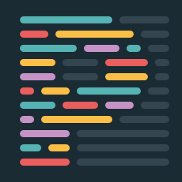
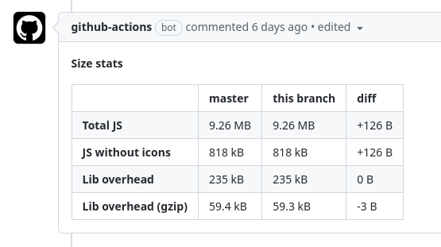
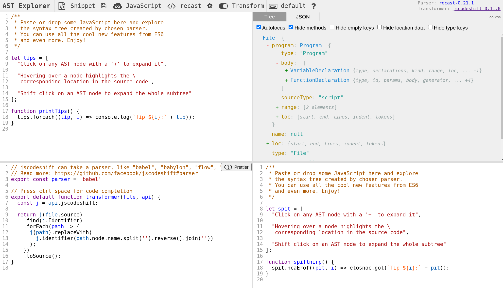

<!-- _paginate: false -->

# **Web Tooling in CTO**
## **TefCon 2022**
**Abel Toledano**

---

# Web Core Team

- We build the web platform used in some of the biggest apps in Telefonica

   

- We believe in a good DX (Developer Experience) as a mean to achieve a good UX (User Experience)

---

# Ok, so I want to build a web. What do I need?

1. Choose a web framework: usually React ⚛️
2. Create React App, Next.js or just Webpack from scratch?
3. What else?

---

# Let's start talking about testing

[](https://twitter.com/rauchg/status/807626710350839808)

---
# Testing Pyramid vs The Testing Trophy


---

# Testing nomenclature

- **Unit testing**: testing a single unit of code in isolation
- **Integration testing**: testing how different units of code work together
- **Acceptance testing**: testing the web in a real browser
  - **Screenshot testing**: Take screenshots of your webapp and compare them with the previous ones. Useful to detect visual regressions.

---

# Unit Testing: Jest & React Testing Library

  
- Run on Node simulating a browser environment (jsdom).
- ⚡ Fast.

---

## Recomendations

- **Always see your test fail.**
- **Avoid testing implementation details:**
  - Refactors (changes to implementation but not functionality) should not break tests.
  - **Avoid snapshot testing**: If your component renders a `<div>` or a `<span>`, or uses inline styles or `classNames` for styling it's often an implementation detail. The markup can change without breaking the component's functionality.
- The more your tests resemble the way your software is used, the more confidence they can give you.
- Test the accesibility of your components.

---

```typescript
test('LogInForm', async () => {
    const loginSpy = jest.fn();

    render(<LogInForm onLogin={loginSpy} />);

    const emailInput = screen.getByLabelText(/email/i);
    const passwordInput = screen.getByLabelText(/password/i);
    const submitButton = screen.getByRole('button', { name: /log in/i });

    expect(emailInput).toBeInTheDocument();
    expect(passwordInput).toBeInTheDocument();
    expect(submitButton).toBeInTheDocument();

    await userEvent.type(input, 'youremail@example.com');
    await userEvent.type(passwordInput, 'password1234');
    userEvent.click(button);

    expect(loginSpy).toHaveBeenCalledWith({
        email: 'youremail@example.com',
        password: 'password1234'
    });
});
```

---

# Acceptance and screenshot testing (Jest with Puppeteer)


- Test the web in a real browser.
- These are the test that better resemble the way a real user uses your webapp.
- The webapp is a complete black box for the test.
- It's recommended to run against a production build of your webapp (`yarn build` in Next.js or Create React App).

---

## [@telefonica/acceptance-testing](https://github.com/Telefonica/js-toolbox/tree/master/packages/acceptance-testing)

### Take screenshots

```typescript
import {openPage, screen, serverHostName} from '@telefonica/acceptance-testing';

test('example screenshot test', async () => {
  const page = await openPage({path: '/foo'});

  await screen.findByText('Some text in the page');

  expect(await page.screenshot()).toMatchImageSnapshot();
});
```
---
### Mock api endpoints
```typescript
import {openPage, screen, createApiEndpointMock} from '@telefonica/acceptance-testing';

test('example screenshot test', async () => {
  const api = createApiEndpointMock({basePath: 'https://my-api-endpoint.com'});

  const getSpy = api.spyOn('/some-path').mockReturnValue({a: 1, b: 2});
  const postSpy = api.spyOn('/other-path', 'POST').mockReturnValue({c: 3});

  const page = await openPage({path: '/foo'});

  expect(getSpy).toHaveBeenCalled();

  await page.click(await screen.findByRole('button', {name: 'Send'}));

  expect(postSpy).toHaveBeenCalled();
});
```
---
# Screenshot testing in Code Reviews

- GitHub has a built-in image diff viewer for PRs. But it's difficult to spot visual differences in some cases.
- We created a browser extension to help with that: [Code Review Extension](https://github.com/Telefonica/cr-extension)
- We recommend including someone from Design Team in the code review process.
---


---

# Testing: Bonus tooling:

- [Jest-runner VSCode extension](https://marketplace.visualstudio.com/items?itemName=firsttris.vscode-jest-runner)


---
# Static Typing: TypeScript


- Catch bugs earlier.
- Brings you additional safety and confidence when writing code.
- Remove a whole category of bugs.
- Good way to start adopting TypeScript in a React codebase:
    - Type component props (replace `propTypes`) and state.
    - Type your api endpoints (requests and responses).
---
## Type your api endpoints

- OpenAPI schema to TypeScript types
- GraphQL schema to TypeScript types
- Custom solutions:
    - In Novum, our api services define an interface using an IDL (Java subset). We have custom tooling to generate static types for our webapp api client from that IDL.
- You can use the same types to generate api stubs:
    - Useful for testing.
    - And for development

---

# Linting: ESLint


- Avoid common mistakes: `no-invalid-regexp`, `no-unsafe-negation`, `no-duplicate-case`, etc.
- Things that TS can't catch on its own.
- Enforce code style. (not code formatting): `prefer-as-const`, `dot-notation`, `object-shorthand`, etc
- Specific rules for some frameworks: `jest/no-disabled-tests`, `react/jsx-no-duplicate-props`, `react-hooks/rules-of-hooks`, etc.
- Customizable: you can create your own rules.
---

## Some linting recomendations

- Marie Kondo principle: "Does this rule bring me joy?"
- Avoid warnings, always use errors.
- For custom rules, try to provide an autofix.

## [@telefonica/eslint-config](https://github.com/Telefonica/js-toolbox/tree/master/packages/eslint-config)


```yaml
# .eslintrc.yaml

extends:
  - '@telefonica/eslint-config'
```

---

# Code formatting: Prettier


- Avoid discussions about code style.
- Consistent code style across the team.
- Easy search and replace code.

## Recomendations
- Configure in your editor to format on save.
- Configure pre-commit hook.
- Make CI fail if code is not formatted.

---

## [@telefonica/prettier-config](https://github.com/Telefonica/js-toolbox/tree/master/packages/prettier-config)

- In your `package.json`:
```json
"prettier": "@telefonica/prettier-config"
```
- Pre-commit hook:
```json
"husky": {
    "hooks": {
        "pre-commit": "lint-staged"
    }
},
"lint-staged": {
    "*.{ts,tsx,js,json,md,yml,yaml}": ["prettier --write"]
}
```
---
# Accessibility testing: Axe


- Test your webapp for accessibility issues.
- Run it in your CI pipeline as part of acceptance tests with Puppeteer.
- Browser extension.

---

## More a11y testing tools:

- ESLint a11y plugin.
- Write tests with react-testing-library.
- Android/iOS built-in screen readers.
- Firefox Accessibility Inspector.

---
# Styles


- Telefonica Design System.
- Big set of React components ready to use.
- Consistent styles and UI/UX patterns across Telefonica Apps.
- Multi brand support: Movistar, O2, Vivo, etc.
- Accessibility.
- Battle tested in production.
- Dark mode support.

---
## CSS solutions

- CSS in JS:
    - JSS
    - Styled Components
    - Emotion
- CSS Modules (built in support in CRA and Next.js)
- Vanilla Extract: similiar to CSS Modules but with the power of TS.
    - We are migrating Mistica to Vanilla Extract.
- Tailwind: utility-first CSS framework

---
# Monitoring: Sentry


- Catch errors in production.
- Any uncaught exception and unhandled Promise error is reported to Sentry.
- Explicit logs: for example, when an unexpected response is received from API.
- In React: log to Sentry in `<ErrorBoundary/>`
- Breadcrumbs support: navigation events, api calls, etc.
- Source maps support: see the original code and stack trace in Sentry.
- CSP violations reporting.
---

# GitHub Actions Workflows

- If you want to enforce some rule (code style, formatting, linting, etc) make CI fail if it's not met.
- Make CI failures clear and actionable.
- Preview deployments in every PR.
    - Helps reviewers see the changes working.
    - Specially useful if you include non-dev stakeholders in the code review process: PMs, Designers, etc.

---
## Some examples: preview

- In Mistica PRs we deploy a preview of Storybook/Playroom:


---
## Some examples: bundle size

- GH Action that shows the difference of JS bundle size caused by the PR:



---
## Some examples: screenshot diffs


---
# Storybook


- Play with your components in isolation.
- Show all the posible states of a component.
- Configure component props using Storybook args.
- Useful for testing.

---
## Mistica Storybook


---
# Playroom


- Build screen prototypes using your components catalog.
- Snippets support.
- Multi theme support.
- Shareable links.
- Useful to create documentation examples.
- Good way to report UI bugs.

---
## Mistica Playroom


---
# Refactoring with codemods: jscodeshift

- A codemod is a tool to automate large-scale codebase refactors.
- It's a script that parses your code into an AST (Abstract Syntax Tree), transforms it, and generates the new code.
- It can be used to update your code to a new API, to migrate from one library to another, etc.
- Like find and replace but on steroids.
- Useful when shiping breaking changes in a library. You release a codemod to help library users migrate to the new version.

---
## Some Examples

- Transform React propTypes to TypeScript types.
- Transform React class components to functional components.
- Transform function callbacks to arrow functions.


---



---
# Build your own tools

- If something can be automated.
- Specially if you and your team mates do it often.
- If it will make dev life easier or help new devs onboard faster.

---
## But with caution
[](https://xkcd.com/1205/)

---
## Example: `yarn setup` in Novum webapp


---
## Useful packages to build CLIs

- [`inquirer`](https://www.npmjs.com/package/inquirer): A collection of common interactive command line user interfaces.
- [`commander`](https://www.npmjs.com/package/commander): The complete solution for node.js command-line interfaces.
- [`chalk`](https://www.npmjs.com/package/chalk)/[`colors`](https://www.npmjs.com/package/colors): Terminal colors.

---
### One extra step: why CLI when I'm a front end developer?
- You can create simple web UIs for your dev tools:


---

# And, that's all for today. Thanks!
# Questions?

---
# References

[Write tests. Not too many. Mostly integration.](https://twitter.com/rauchg/status/807626710350839808)
[Test Pyramid](https://martinfowler.com/bliki/TestPyramid.html)
[The Testing Trophy and Testing Classifications](https://kentcdodds.com/blog/the-testing-trophy-and-testing-classifications)
---
